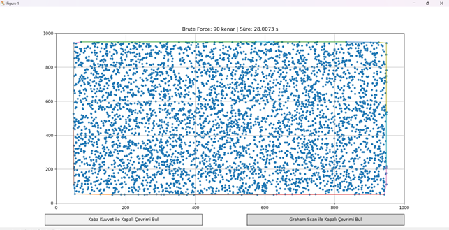
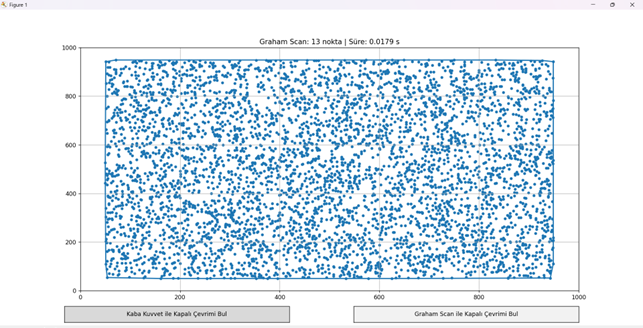
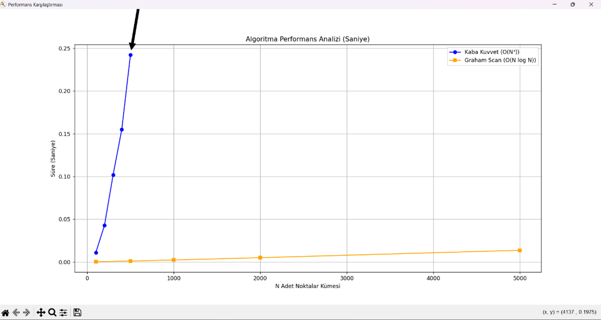

# Convex Hull Problemi: Brute Force ve Graham Scan Algoritmalarının Karşılaştırılması(Python)

## Proje Açıklaması

Bu projede, **Convex Hull (Kapalı Çevrim)** probleminin çözümü için iki farklı algoritma uygulanmış ve karşılaştırılmıştır:

- **Brute Force (Kaba Kuvvet) Algoritması**
- **Graham Scan Algoritması**

Amaç, bu algoritmaların **teorik zaman karmaşıklıkları** ile **deneysel çalışma süreleri** arasındaki ilişkiyi incelemek ve farklı veri boyutlarında performanslarını analiz etmektir.

Bu çalışma, **Algoritma Analizi ve Tasarımı** dersi kapsamında hazırlanmıştır.

---

## Convex Hull Problemi Nedir?

Convex Hull, düzlemde verilen noktalar kümesini çevreleyen **en küçük dışbükey poligonun** bulunması problemidir.

Başka bir ifadeyle:
- Noktaların etrafına lastik geçirilmiş gibi düşünüldüğünde oluşan sınırdır.

Bu problem aşağıdaki alanlarda yaygın olarak kullanılmaktadır:

- Bilgisayarlı geometri  
- Görüntü işleme  
- Robotik  
- Haritalama sistemleri  

---

## Kullanılan Algoritmalar

### 1. Brute Force Algoritması

Bu yöntemde:

- Her nokta çifti bir kenar adayı olarak seçilir.
- Tüm diğer noktaların bu doğruya göre aynı tarafta olup olmadığı kontrol edilir.

#### Zaman Karmaşıklığı

**O(N³)**

Sebep:
- Nokta çiftleri → O(N²)
- Her çift için kontrol → O(N)

Bu nedenle büyük veri setlerinde oldukça yavaştır.

---

### 2. Graham Scan Algoritması

Bu algoritma üç aşamadan oluşur:

1. Pivot noktası seçilir  
2. Noktalar polar açıya göre sıralanır  
3. Stack kullanılarak dışbükey yapı oluşturulur  

#### Zaman Karmaşıklığı

**O(N log N)**

Bu nedenle büyük veri kümelerinde oldukça verimlidir.

---


## Dosya Açıklamaları

### main.py
- GUI arayüzü  
- Nokta üretimi  
- Algoritma çalıştırma  
- Grafik çizimi  

### hull_algorithms.py
- Brute Force algoritması  
- Graham Scan algoritması  

### utils.py
- Nokta üretme fonksiyonları  
- Grafik çizdirme işlemleri  

### performance_test.py
- Performans ölçümleri  
- Grafik oluşturma  

---

## Kurulum

Gerekli kütüphaneleri yüklemek için:

```bash
pip install matplotlib numpy
 ```
### Projeyi Çalıştırma
```
python main.py
```
---

## Performans Testi

Farklı veri boyutları için test yapılmıştır:

N = 100

N = 500

N = 1000

N = 2000

N = 5000

N = 10000
---

## Sonuçlar
### Brute Force

Küçük veri setlerinde çalışır

N ≥ 1000 sonrası ciddi yavaşlama görülür

N ≥ 10000 pratik değildir



### Graham Scan
Tüm veri setlerinde hızlıdır

Milisaniye seviyesinde sonuç üretir



---

## Grafiksel Karşılaştırma

Grafikte:

X ekseni → Nokta sayısı

Y ekseni → Çalışma süresi

---

### Sonuç:

Graham Scan algoritması büyük veri setlerinde açık şekilde daha performanslıdır.

---
### Deneysel Gözlemler

Teorik karmaşıklık ile deneysel sonuçlar uyumludur

Brute Force algoritması kübik büyüme göstermektedir

Graham Scan algoritması logaritmik büyüme göstermektedir


